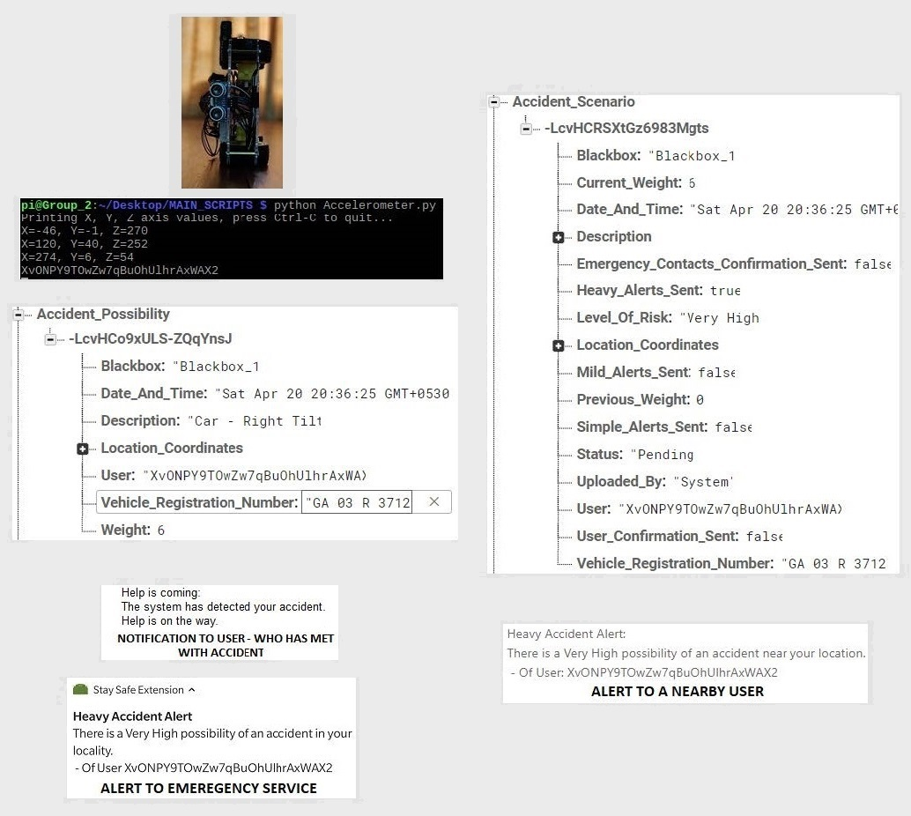

<!-- Reference:
https://github.com/othneildrew/Best-README-Template -->

<!-- PROJECT LOGO -->
 

  <h1><i>Stay Safe</i></h1>

  
  
  . 

  

    A GPS-based real-time Accident Management System !
  

 

<!-- TABLE OF CONTENTS -->

  
Table of Contents

  <ol>
    <li><a href="#about-the-project">About The Project</a></li>
    <li><a href="#built-with">Built With</a></li>
    <li><a href="#getting-started">Getting Started</a></li>
    <li><a href="#overview">Overview</a></li>
    <li><a href="#license-or-author">License or Author</a></li>
    <li><a href="#contact">Contact</a></li>
    <li><a href="#acknowledgments">Acknowledgments</a></li>
  </ol>

 

<!-- ABOUT THE PROJECT -->
## About The Project
  An IoT project providing a collaborated solution for accident prevention, accident detection and rescue/aid – using a blend of Cross-platform applications, Microservices & Embedded Technology.

  

  .

  Following are some of the most crucial functions of this system:
  1. <b> Cross-platform User Application: </b>
      Used to dynamically support interfaces for 3 unique types of users.
  2. <b> Compact IoT Device (Blackbox): </b> To be attached to vehicles, so as to effectively pick up and translate sensor readings.
  3. <b> Accident Prevention: </b> Carried out by providing shortest and safest path (2 approaches) - (But, stressing more on User Safety).
  4. <b> Accident Detection: </b> Done with the help of a variety of sensors, attached to the blackbox. It also utilizes user uploads from multiple accident scenarios (through mobile application).
  5. <b> Rescue & Aid:  </b> Government emergency services, ambulances, etc are made more efficient to provide quick aid/rescue. User’s personal emergency contact list also has a role to play.
  6. <b> Pass vehicle control </b>
  7. <b> 24 x 7 automated support </b>
  
  

  .

  #### Concept of Blackspots
  * Black spots refer to areas on the road where there is a possibility of accident (i.e. accident prone zones).
  * The black spots will be of the following types:
    1. Locations which have a high possibility of vehicle accidents, depending on the recorded scenarios.
    2. Locations which are accident- prone only for a small period of time:
    3. Locations where accidents have occurred due to ill condition of the road, i.e.: in cases where immediate repairs are required.
  
  
(<a href="#readme-top">back to top</a>)

## Built With
  &nbsp; &nbsp; &nbsp;  &nbsp; &nbsp; &nbsp; &nbsp; &nbsp;  &nbsp; &nbsp; &nbsp; &nbsp; &nbsp;  &nbsp; &nbsp; &nbsp; &nbsp; &nbsp;  &nbsp; &nbsp; &nbsp; &nbsp; &nbsp; &nbsp; &nbsp;  &nbsp; &nbsp; &nbsp; &nbsp; &nbsp; &nbsp; 

  &nbsp; &nbsp; &nbsp; &nbsp; <b><i> Java </i></b> &nbsp; &nbsp; &nbsp; &nbsp; &nbsp; &nbsp; &nbsp; &nbsp; &nbsp; &nbsp; <b><i> Python </i></b> &nbsp; &nbsp; &nbsp; &nbsp; &nbsp; &nbsp; &nbsp; &nbsp; &nbsp; &nbsp; <b><i> Node.js </i></b> &nbsp; &nbsp; &nbsp; &nbsp; &nbsp; &nbsp; &nbsp; <b><i> Apache Cordova </i></b>  &nbsp;  &nbsp; &nbsp; &nbsp; &nbsp; &nbsp; <b><i> Firebase </i></b> &nbsp; &nbsp; &nbsp; &nbsp; &nbsp; &nbsp; <b><i> Raspberry Pi </i></b>

  
(<a href="#readme-top">back to top</a>)

<!-- GETTING STARTED -->
## Getting Started
  ### Prerequisites
  * Java, Python, Node.js, Apache Cordova
  * Google Cloud - Firbase, Cloud Messaging
  * Raspberry Pi, Sensors.
  * IDE - VS Code, Android Studio
  * Windows/MacOs/Linux - Minimum 4GB RAM, Intel i5 Processor (or Equivalent)
  * Android, iOS - Minimum 4GB RAM, Qualcomm 755 Processor (or Equivalent)
  
  ### Setup & Use
  Being an IoT application, to experience the full fledged implementation, one needs the blackbox device with unique identifier to be purchased from the licence holders.

  To simply experience the end-user application, one can easily do so by installing the <b>'apk'</b> file that has been provided in the parent directory.

  

  #### Setup Entire Project (Except for IoT Component)
  The source codes are available in 'Project/' folder.
  1. ##### 'Project/Cordova App/Maps':
      * Contains the source code for cross-platform front end implementation.
      * It is a Cordova application, and can hence be run over node.js server.
  
  2. ##### 'Project/Android - FCM Extension':
      * This is an android-specific application, which needs to be installed along with the main application to be able to provide notifications support (only on Android devices).
      * It can be imported and updated in Android Studio.

  3. ##### 'Project/Real Time Database - [Sample Data]':
      * This directory contains the sample data and configuration for the <b>'Real-time Database'</b>.
      * For this, we need to create and set-up cour project on Google Cloud Platform (GCP) --> Firebase.
      * Then, we can use the content of this directory to add and configure our 'Firebase real-time DB'.
      * The credentials for this DB then needs to be updated in the main application and extension, discussed in the first 2 sections.

  4. ##### 'Project/Firebase_Functions':
      * This directory contains the microservices that needs to be hosted on Google Cloud Platform (GCP) -> Firebase.
      * Once the project has been been created on GCP, then we need to add a hosting component, i.e. 'Firebase Functions'.
      * Once set up, we can use the contents of this directory with the update DB credentials (from Part 3) to host the microservices.
      * Once hosted, the credentials for these microservices then need to be updated in the main application and extension, discussed in the first 2 sections.

  ### Note:
  The API Keys, used in this application will expire or be disabled at some point.
  - The application will continue to run smoothly, as long as the API Keys are 'Active'.
    [However, some errors will start showing up, once these keys have 'Expired' or been 'Disabled']

  
(<a href="#readme-top">back to top</a>)

<!-- Overview -->
## Overview
  #### What has been done to bring the implementation to life ?
  * Created a real time, multi-platform application - with unique dynamic functionalities for 3 sets of users.
  * Created Black Box Device to automatically detect accident of vehicles & integrated it with user application.
  * Created Web Services to implement algorithms & performed Data Analytics to provide better responses.
  
  

  #### A Graphical Representation:
  

  #### Some Sample Runs with the IoT Device:
  * ###### Sample Run 1
  

  * ###### Sample Run 2
  

  
(<a href="#readme-top">back to top</a>)

<!-- LICENSE -->
## License or Author
  * Uditya Laad
  * Vijay Mone
  * Kaushik Gaunekar
  * Prajyot Naik
  * Siddhi Naik (Project Guide)

  
(<a href="#readme-top">back to top</a>)

<!-- CONTACT -->
## Contact
  <b>Uditya Laad</b> &nbsp; [@linkedin.com/in/uditya-laad-222680148](https://www.linkedin.com/in/uditya-laad-222680148/)
  
  &nbsp; &nbsp; &nbsp; &nbsp; &nbsp; &nbsp; &nbsp; &nbsp; &nbsp; &nbsp; &nbsp; [@github.com/udityalaad](https://github.com/udityalaad)
  
  &nbsp; &nbsp; &nbsp; &nbsp; &nbsp; &nbsp; &nbsp; &nbsp; &nbsp; &nbsp; &nbsp; udityalaad123@gmail.com

  <b>Project Link</b> &nbsp; [https://github.com/udityalaad/GpsBased_RealTime_AccidentManagementSystem](https://github.com/udityalaad/GpsBased_RealTime_AccidentManagementSystem)

  
(<a href="#readme-top">back to top</a>)

<!-- ACKNOWLEDGMENTS -->
## Acknowledgments
  * Many thanks to <b>Prof. Siddhi Naik (Goa College of Engineering)</b> for her guidance and assistance throughout the project.
  * Special thanks to <b>Prof. Devendra Kuvelkar</b> for his guidance and support during the initial phases of the project.
  * C. Prabhu and R. Sunitha and R. Anitha Automatic Vehicle Accident Detection and Messaging System Using GSM and GPS Modem, (2014)
  * Uses of Digital Road Maps, Japan Digital Road Map Association, (2014)
  * Stefanie Sohnchen, GPS Everywhere – Accident Prevention and Management, (2015)
  * Accelerometer (ADXL345), Piddler, (2017)
  * MATT, Ultrasonic Distance Measurement Using Python, Raspberry Pi Spy, (2012)
  * Raspberry PI 3 Model B+ Motherboard, Amazon
  * Contraction Hierarchies, Wikipedia
  * Node.js, Introduction, W3Schools
  * xcluma ADXL345 Digital Accelerometer Tilt Sensor Module, Amazon
  * REES52 Ultrasonic Range Finder Module Sensor Distance Measuring Transducer, Amazon
  * [github.com/othneildrew/Best-README-Template/](https://github.com/othneildrew/Best-README-Template)
  * [HD wallpaper: Need for Speed Heat, Race Car](https://www.wallpaperflare.com/need-for-speed-heat-race-car-wallpaper-gxvsg)

  
(<a href="#readme-top">back to top</a>)

